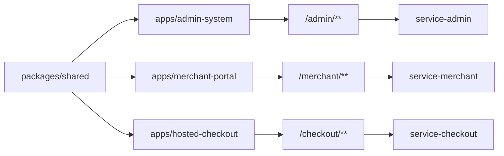

# 前端架构收敛路线图

## 1. 文档定位

本文描述 `acquiring-frontend` 作为支付收单平台前端仓库的当前结构、架构约束和后续收敛方向。

后端仓库是：

```text
/Users/scott/Documents/code/ideaCodex/acquiring-orchestration
```

前端仓库只维护 Vue 前端应用和共享前端包，不生成后端 Java 代码，不自行发明后端不存在的支付业务接口。

## 2. 当前应用结构

```text
acquiring-frontend
├── apps
│   ├── admin-system
│   ├── merchant-portal
│   └── hosted-checkout
└── packages
    └── shared
```

职责：

1. `apps/admin-system`：后台管理系统，对接 `/admin/**`。
2. `apps/merchant-portal`：商户后台，对接 `/merchant/**`。
3. `apps/hosted-checkout`：Hosted Checkout 收银台，对接 `/checkout/**`。
4. `packages/shared`：品牌、支付图标、通用 HTTP 客户端、通用类型、通用展示工具。

## 3. 前端架构关系图



## 4. 当前扫描结论

### 4.1 `admin-system`

当前状态：

1. 已使用 `packages/shared` 的 `createHttpClient` 作为主要请求封装。
2. 请求会自动注入 `Authorization`、`X-Request-Id`、操作者信息、商户上下文和 `Accept-Language`。
3. 路由根据后端返回菜单动态生成。
4. `hydrateSession()` 会在路由权限判断前刷新登录态和菜单，支持权限页深链刷新。
5. 已具备 `v-hasPermi`、`v-hasRole` 权限指令。
6. 已有 `BaseDateTime`、`BaseAmount`、`BaseStatusTag`、`RightToolbar` 等后台通用组件。

需要继续收敛：

1. 少量旧 `utils/request.ts` axios 封装仍存在，应逐步迁移到共享 HTTP 客户端。
2. 支付、退款、代付、结算、通道页面入口需要以后端真实交易能力为准，不要做假业务闭环。
3. 敏感密钥页面必须继续默认展示摘要、版本、算法、指纹，不展示完整密钥。

### 4.2 `merchant-portal`

当前状态：

1. 已使用共享 `createHttpClient`。
2. 已通过后端菜单动态生成商户侧路由。
3. 已有商户账号、部门、岗位、角色、菜单授权等系统管理页面。
4. 商户 session 独立存储，与后台管理 session 隔离。

需要继续收敛：

1. 交易、订单、退款、结算页面必须等待后端真实接口支撑。
2. 页面不得自行推导资金状态或虚构交易状态。
3. 商户数据必须以后端返回的商户上下文和权限为准，不允许前端通过路由参数越权拼接查询。

### 4.3 `hosted-checkout`

当前状态：

1. 当前主要是收银台体验、品牌展示、支付方式展示和国家配置读取。
2. 已调用 `/checkout/config/countries` 获取国家配置。
3. 当前页面内的支付成功、失败、处理中、拦截状态属于前端预览态，不代表真实交易状态。

需要继续收敛：

1. 补齐 checkout session 查询。
2. 后端返回订单金额、币种、商户、商品摘要、支付方式配置。
3. 支付提交必须走后端受控接口。
4. 支付结果必须通过后端查询或回调状态确认。
5. 前端不得保存 PAN、CVV、PIN，不得把卡敏感数据写入日志或本地存储。

## 5. 共享层目标结构

目标结构：

```text
packages/shared/src
├── auth
├── http
├── result
├── types
├── brand
├── payment
└── utils
```

当前 `packages/shared/src/index.ts` 已承载较多类型和工具。后续可以在不改变外部导入行为的前提下，逐步拆分内部文件，再由 `index.ts` 统一导出。

## 6. 前端约束

### 6.1 API 约束

1. 新增 API 前必须先搜索现有 `api` 目录、后端接口和文档。
2. 不允许自行创造后端不存在的接口。
3. 请求协议处理放在 `api` 层或共享 HTTP 层，页面只处理业务对象。
4. 管理后台、商户后台必须使用对应 baseURL，不允许跨系统复用 token。

### 6.2 权限约束

1. 路由权限来自后端菜单和权限码。
2. 按钮权限使用 `v-hasPermi` 或等价共享能力。
3. 前端权限码必须与后端 `@RequiresPermission` 和数据库权限码一致。
4. 前端隐藏按钮不是安全边界，后端必须继续鉴权。

### 6.3 支付展示约束

1. 使用项目已有状态枚举，不发明 `DONE`、`COMPLETE`、`FINISHED` 等状态。
2. 金额展示必须包含币种。
3. 日期时间展示统一为 `yyyy-MM-dd HH:mm:ss`。
4. 卡号、邮箱、手机号、密钥、token 默认脱敏。
5. 不展示 CVV、PIN、完整卡号、完整密钥、JWT Secret。

### 6.4 Hosted Checkout 约束

1. 移动端优先，必须支持 375px 宽度。
2. 不使用后台管理式表格和复杂导航。
3. 收银台页面只展示后端授权的支付方式。
4. 支付动作必须防重复提交。
5. 支付按钮状态必须跟随后端会话和提交状态。

## 7. 分阶段收敛计划

### 第一阶段：统一请求层

1. 清理 `admin-system` 剩余旧请求封装使用点。
2. 将通用错误提示、未授权处理、请求 ID 注入统一保留在共享 HTTP 层。
3. 保持 admin 和 merchant session 独立。

### 第二阶段：统一菜单和权限工具

1. 抽取 admin 和 merchant 共用的菜单扁平化、动态路由辅助函数。
2. 保留各应用自己的布局、视图路径和权限显示策略。
3. 增加权限码一致性检查脚本或文档检查清单。

### 第三阶段：交易页面接入真实能力

1. admin 交易、退款、代付、结算、通道页面只接已落地的后端接口。
2. merchant 交易查询、订单查询、退款申请、结算查询按后端权限和数据范围接入。
3. 交易状态、金额、币种、渠道结果均以后端返回为准。

### 第四阶段：Hosted Checkout 真实链路

1. 接入 checkout session。
2. 接入支付方式配置。
3. 接入支付提交。
4. 接入支付结果查询。
5. 接入失败、处理中、风控拦截的真实状态展示。

## 8. 验证要求

前端架构调整后至少验证：

```bash
pnpm --filter admin-system build
pnpm --filter merchant-portal build
pnpm --filter hosted-checkout build
```

如涉及登录、菜单、权限或深链，还需要浏览器验证：

1. 未登录访问权限页跳转登录。
2. 登录后刷新权限页能恢复菜单和路由。
3. 无权限按钮不显示。
4. 无权限路由进入 403。
5. admin 和 merchant 登录态互不污染。
